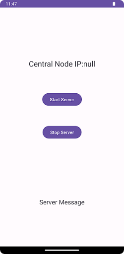
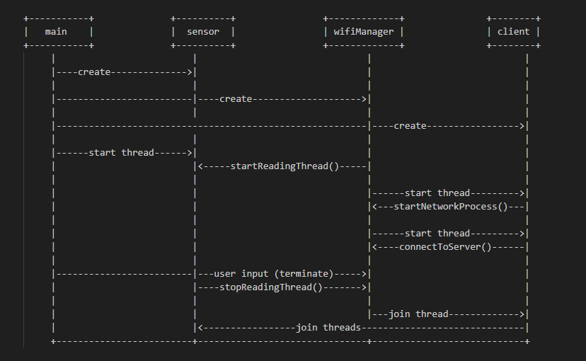
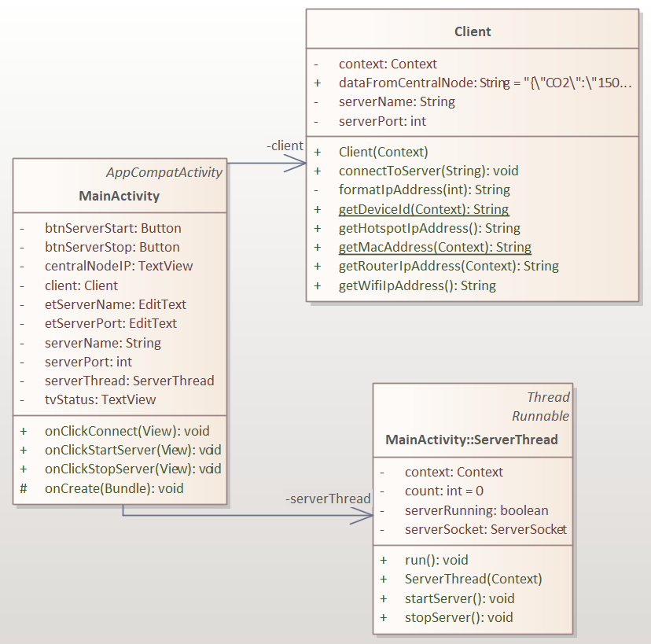
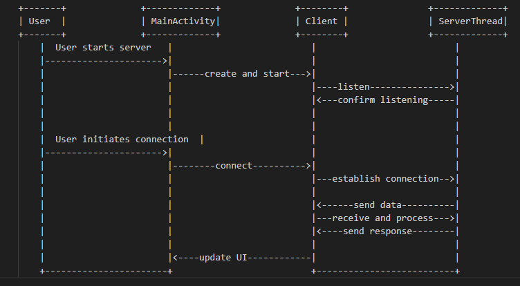
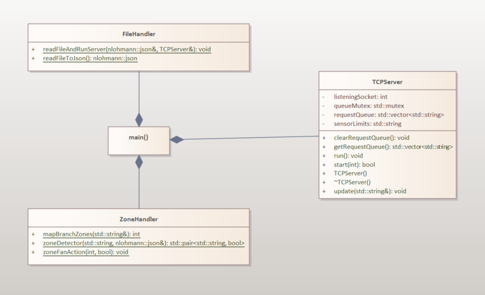
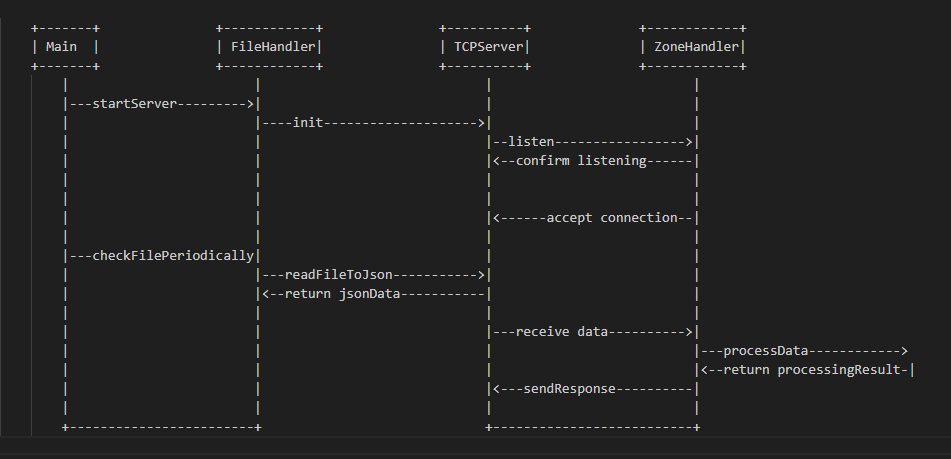
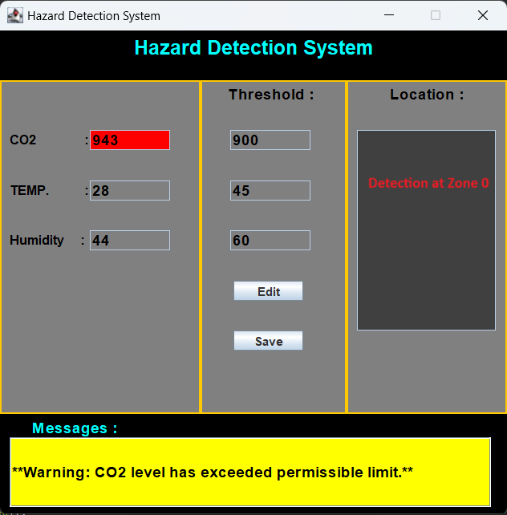
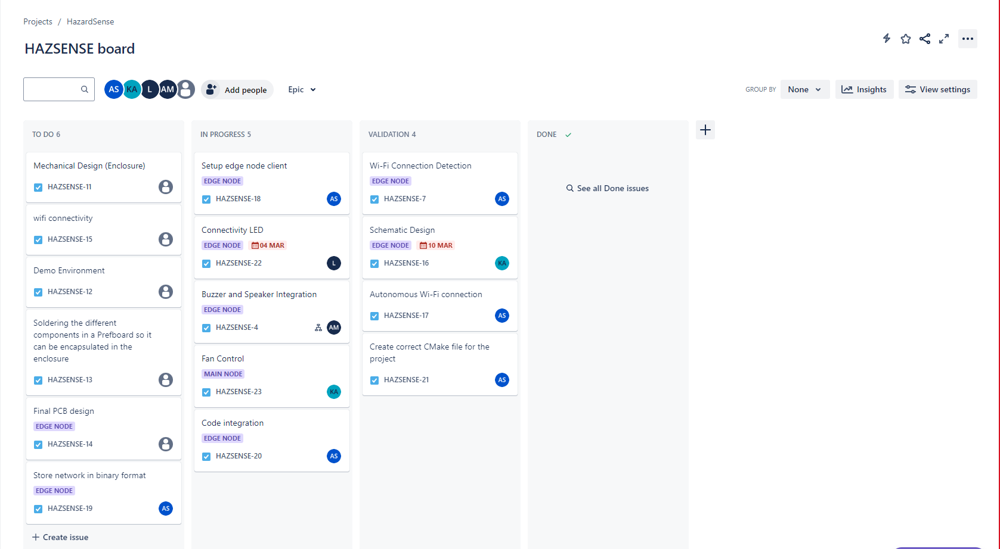

# HazardSense: Environmental Monitoring and Hazard Prevention System

[](https://github.com/UofGlasgow-ES-Team5/Centralized-Hazard-Detection-System-/graphs/contributors)
[](https://github.com/UofGlasgow-ES-Team5/Centralized-Hazard-Detection-System-/stargazers)
[](https://github.com/UofGlasgow-ES-Team5/Centralized-Hazard-Detection-System-/forks)

## Contents

- [Introduction](#Introduction)
- [Motivation](#Motivation)
- [Hardware Requirements](#Hardware-Requirements)
- [User Stories](#User-Stories)
- [Node Functionalities](#Node-Functionalities)
- [Project setup](#Project-setup)
- [Project workflow](#Project-workflow)
- [Utility commands](#Utility-commands)

## Introduction:

HazardSense is an environmental monitoring system designed to enhance indoor safety and air quality through its environmental monitoring and hazard prevention capabilities. By utilising an advanced high-precision sensor to measure CO2 and temperature levels, the system can detect air quality issues and taking immediate corrective actions to prevent potential health risks.

Whilst demonstrated using CO2 gas, the system's adaptability and scalability provides the capability to detect various poisonous gases, and makes it suitable for a range of settings, from homes to research labs and industrial factories.

_Stay in the loop and follow us on [Instagram](https://www.instagram.com/hazardsense?igsh=OGQ5ZDc2ODk2ZA%3D%3D&utm_source=qr) for all the coolest updates! Exclusive content, behind-the-scenes sneak peeks, and epic vibes await. Don't miss out, join the squad now!🛡️🚨💨🔥🌐💻_

## Motivation

The development of HazardSense was driven by the dire need to combat the invisible, but significant, dangers of gases, as well as the provision of safe, comfortable, and more productive environments.

## Hardware Requirements

### 1. Central Node:

- 1.1. Raspberry Pi 3 Model B
- 1.2. MicroSD card\*\* (with Raspbian OS installed)
- 1.3. 2 x 5V DC fans
- 1.4. 2 x 2N2222 NPN Transistors
- 1.5. 2 x 1N4001 Diodes (for reverse polarity protection)
- 1.6. 2 x 220ohm Resistors

  

### 2. Branch Node:

- 2.1 Android mobile device

  

### 3. Edge Node:

- 3.1. Raspberry Pi 4 Model B
- 3.2. MicroSD card (with Raspbian OS installed)
- 3.3. SCD40 Module (I2C-compatible CO2, temperature, and humidity sensor)
- 3.4. Hw-131 Power Module
- 3.5. I2C-compatible LCD
- 3.6. 2x 220m Ohm Resistors
- 3.7. Red LED (for hazard indication)
- 3.8. Blue LED (for Wi-Fi connectivity indication)
- 3.9. 3.3V Active Buzzer

  

## User Stories

### Edge Node:

> **As an employee**, I want to detect environmental hazards, such as gas concentrations and high temperatures, and have a buzzer sound during hazardous situations so that I can quickly and safely vacate the area.

### Branch Node:

> **As an administrator**, I want to efficiently receive environmental threshold values from the Central Node and securely transmit the information to edge nodes, so that each edge node is configured with the latest environmental thresholds and each branch node is identified for location determination.

### Central Node:

> **As an administrator**, I want the central node to receive and process hazard data from all edge nodes so that I can rapidly alert employees in the area and take appropriate response action, such as ensuring proper ventilation.

## Node Functionalities

### 1. Edge Node:

The Edge node, serving as a mobile device accompanying personnel in the field, operates through three distinct threads:

- **1.1. Wifi Thread:** Its primary function is to search for and establish a connection with the strongest Wi-Fi signal available.It conducts network scans at intervals of 20 seconds to ensure optimal connectivity.
- **1.2. Sensor Thread:** This thread retrieving data from the sensors deployed at the Edge node.
  It then presents this sensor data on the LCD screen for monitoring purposes. This thread also acquires the Sensor limits configured via the Central Node and executes control logic for Buzzer and LED devices interfaced with the Edge node.
- **1.3. Client Thread:** This thread initiates and maintains communication links with the branch node.
  It transmits sensor readings to the branch node for further analysis or processing and receives updates on sensor limits from the branch node and adjusts the corresponding variables accordingly.

  **_Edge Node Class Diagram_**

  

  **_Edge Node Sequence Diagram_**

  

### 2. Branch Node:

The branch node serves as a network device responsible for establishing a communication link (TCP) between the edge node and the central node. Its key functionalities include:

- **2.1. Communication Link Establishment:** It facilitates the creation of a TCP communication link between the edge node and the central node, enabling seamless data exchange.
- **2.2. Sensor Data Relay:** The branch node receives sensor data from the edge node. It appends its MAC address to the received data packet. Subsequently, it forwards the packet to the central node.
- **2.3. MAC Address Appendage:** Adding its MAC address to the packet serves the purpose of aiding the central node in determining the precise location of the originating edge node.

  **_Branch Node Class Diagram_**

  

  **_Branch Node Sequence Diagram_**

  

### 3. Central Node:

This node acts as the command centre of the Hazard Detection system. This node has 4 threads:

- **3.1. Main Thread:** This thread executes the main function, where the server is started and the main loop runs. It continuously checks for incoming requests from clients and processes them. This thread is responsible for coordinating the overall execution flow of the program.
- **3.2. File Reader Thread:** This thread is started to read sensor limit data from a file (`sensor_limits.txt`) and update the server with this data periodically. It calls the `readFileAndRunServer` function, which reads the file, converts its contents to JSON format, and then updates the server with the new sensor limits. This thread sleeps for 5 seconds after each update to the server.
- **3.3. Server Thread:** This thread is responsible for running the TCPServer instance. It continuously listens for incoming connections and handles client requests. This thread executes the `run` method of the `TCPServer` class.
- **3.3. GUI Thread:** Responsible for managing the graphical user interface (GUI) visible to users at the Central Node, this thread presents visual readings derived from data captured by the edge node device. Moreover, it enables users to modify sensor limits. Should any sensory input exceed the permissible limits, the GUI promptly relays the corresponding location information and displays a warning message to alert users.

  **_Central Node Class Diagram_**

  

  **_Central Node Sequence Diagram_**

  

## Project setup

Clone the Git repository to the Edge, Branch and Central devices respectively. Then run the following commands to get the project working.

**Dependencies**:

- `nmcli `
- `cmake `
- `make`
- `java`

### 1. Edge Node

<details>
    <summary>Get started with the Edge node!</summary>
    
1. Install dependencies
       ```
       sudo apt-get install network-manager
       sudo apt install cmake
       sudo apt install make
       ```
2. Clone repository
       ```
       git clone https://github.com/UofGlasgow-ES-Team5/Centralized-Hazard-Detection-System-.git
       ```
3. Navigate to Edge node directory

    ```
    cd EdgeNode
    ```

4. Run the CMake command
   ```
   cmake .
   ```
5. Run the Make file
   ```
   make
   ```
6. Release all GPIO pins
   ```
   sudo killall pigpiod
   ```
7. Run the Edge node executable file
   ```
   sudo ./main
   ```

</details>

### 2. Brand Node

<details>
    <summary>Get started with the Branch node!</summary>
    
1. Navigate to APK directory in the Branch node directory

```

cd BranchNode\APK\

```

2. Install the Android application using the APK files
3. Click on _Start Server_ button on the application
</details>

### 3. Central Node

<details>
    <summary>Get started with the Central node!</summary>

1. Install dependencies

   ```
   sudo apt install default-jdk
   sudo apt install cmake
   sudo apt install make
   ```

2. Clone repository

   ```
   git clone https://github.com/UofGlasgow-ES-Team5/Centralized-Hazard-Detection-System-.git
   ```

3. Navigate to Central node directory

   ```
   cd CentralNode\
   ```

4. Run the CMake command

   ```
   cmake .
   ```

5. Run the Make file

   ```
   make
   ```

6. Release all GPIO pins

   ```
   sudo killall pigpiod
   ```

7. Run the Central node executable file

   ```
   sudo ./main
   ```

8. Open a new Terminal window
9. Navigate to the Central node GUI app

   ```
   cd CentralNode\GUI_HD\src\
   ```

10. Compile files for Central node GUI

    ```
    javac Main.class
    ```

11. Launch Central node GUI

    ```
    java Main
    ```

    

</details>

## Project workflow

The team utilized the Jira board to implement agile software development methodology. This involved dividing tasks among team members, allocating time slots to individual tasks, and tracking the status of tasks. The Board can be accessed via the following link: **[Jira Board](https://student-2951278a.atlassian.net/jira/software/projects/HAZSENSE/boards/2?atlOrigin=eyJpIjoiYjcxMzY2ZmU3MjE1NGFhNWEzOWFmYWMzOGUyNGZmM2MiLCJwIjoiaiJ9)**



## Utility commands

#### Compilation command for Edge Node

```
g++ -o main main.cpp Client.cpp SensorReader.cpp WifiManager.cpp scd4x_i2c.c sensirion_common.c sensirion_i2c_hal.c sensirion_i2c.c -I. -lpigpio -llcd1602 -lrt -pthread -L. -w
```

#### Compilation command for Central Node

```
g++ -o main main.cpp TCPServer.cpp FileHandler.cpp ZoneHandler.cpp -pthread -lpigpio
```

#### To release GPIO

```
sudo killall pigpiod
```

#### Run command

```
cmake .
make
sudo ./main
```

#### Connect to WiFi

```
sudo nmcli device wifi connect <WiFi> password <password>
```

#### TCP Server test

```
telnet localhost 1352
```
