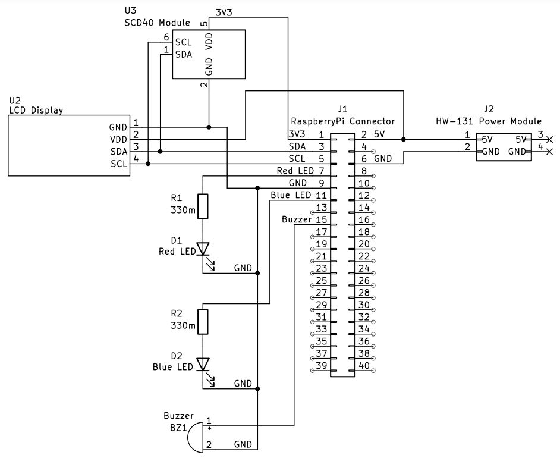

# HazardSense: Environmental Monitoring and Hazard Prevention System


## Introduction:
HazardSense is an environmental monitoring system designed to enhance indoor safety and air quality through its environmental monitoring and hazard prevention capabilities. By utilising an advanced high-precision sensor to measure CO2 and temperature levels, the system can detect air quality issues and taking immediate corrective actions to prevent potential health risks.

Whilst demonstrated using CO2 gas, the system's adaptability and scalability provides the capability to detect various poisonous gases, and makes it suitable for a range of settings, from homes to research labs and industrial factories.


## Motivation
The development of HazardSense was driven by the dire need to combat the invisible, but significant, dangers of gases, as well as the provision of safe, comfortable, and more productive environments.


## Hardware Requirements

### 1. Main Node:
- 1.1. Raspberry Pi 3 Model B
- 1.2. MicroSD card** (with Raspbian OS installed)
- 1.3. 2 x 5V DC fans
- 1.4. 2 x 2N2222 NPN Transistors
- 1.5. 2 x 1N4001 Diodes (for reverse polarity protection)
- 1.6. 2 x 220ohm Resistors

### 2. Edge Node:
- 2.1. Raspberry Pi 4 Model B
- 2.2. MicroSD card (with Raspbian OS installed)
- 2.3. SCD40 Module (I2C-compatible CO2, temperature, and humidity sensor)
- 2.4. Hw-131 Power Module
- 2.5. I2C-compatible LCD
- 2.6. 2x 220m Ohm Resistors
- 2.7. Red LED (for hazard indication)
- 2.8. Blue LED (for Wi-Fi connectivity indication)
- 2.9. 3.3V Active Buzzer


## Compilation command
```
g++ -o main main.cpp CO2Sensor.cpp scd4x_i2c.c sensirion_common.c sensirion_i2c_hal.c sensirion_i2c.c -I. -lpigpio -llcd1602 -lrt -pthread -L. 
```

## Run command
```
sudo ./main
```